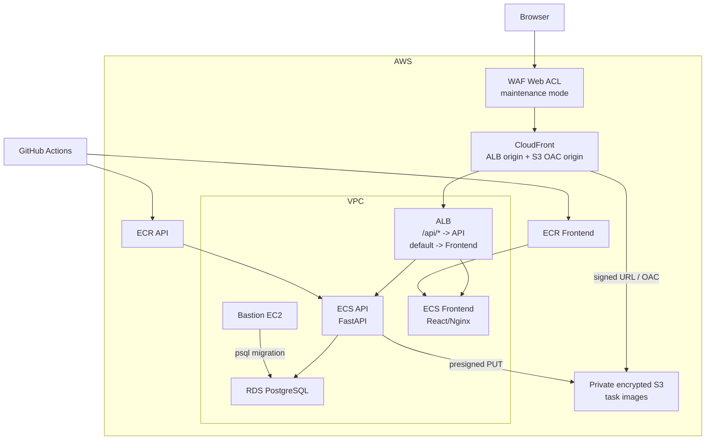
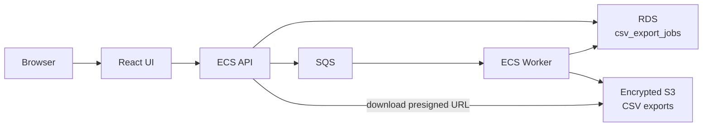
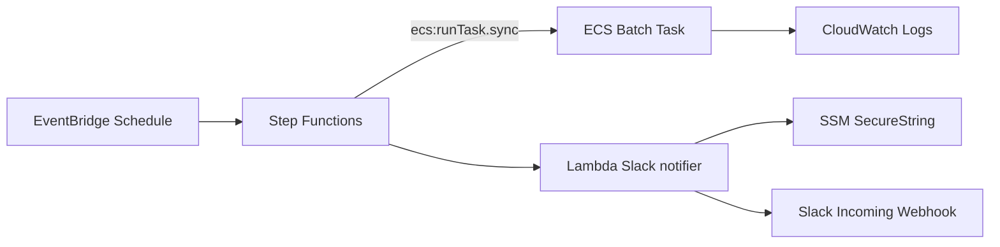

# Study_AWS-3 構成図

## 課題1

```mermaid
flowchart TB
  client["Browser"]
  github["GitHub Actions"]

  subgraph aws["AWS"]
    waf["WAF Web ACL<br/>maintenance mode"]
    cf["CloudFront<br/>ALB origin + S3 OAC origin"]
    ecrApi["ECR API"]
    ecrFe["ECR Frontend"]

    subgraph vpc["VPC"]
      alb["ALB<br/>/api/* -> API<br/>default -> Frontend"]
      bastion["Bastion EC2"]
      api["ECS API<br/>FastAPI"]
      frontend["ECS Frontend<br/>React/Nginx"]
      rds["RDS PostgreSQL"]
    end

    s3["Private encrypted S3<br/>task images"]
  end

  client --> waf --> cf --> alb
  cf -->|"signed URL / OAC"| s3
  alb --> api
  alb --> frontend
  api --> rds
  api -->|"presigned PUT"| s3
  bastion -->|"psql migration"| rds
  github --> ecrApi --> api
  github --> ecrFe --> frontend
```

## 課題2

```mermaid
flowchart LR
  browser["Browser"] --> frontend["React UI"]
  frontend --> api["ECS API"]
  api --> rds["RDS<br/>csv_export_jobs"]
  api --> sqs["SQS"]
  sqs --> worker["ECS Worker"]
  worker --> rds
  worker --> s3["Encrypted S3<br/>CSV exports"]
  api -->|"download presigned URL"| s3
```

## 課題3

```mermaid
flowchart LR
  eb["EventBridge Schedule"] --> sfn["Step Functions"]
  sfn -->|"ecs:runTask.sync"| task["ECS Batch Task"]
  task --> logs["CloudWatch Logs"]
  sfn --> lambda["Lambda Slack notifier"]
  lambda --> ssm["SSM SecureString"]
  lambda --> slack["Slack Incoming Webhook"]
```

